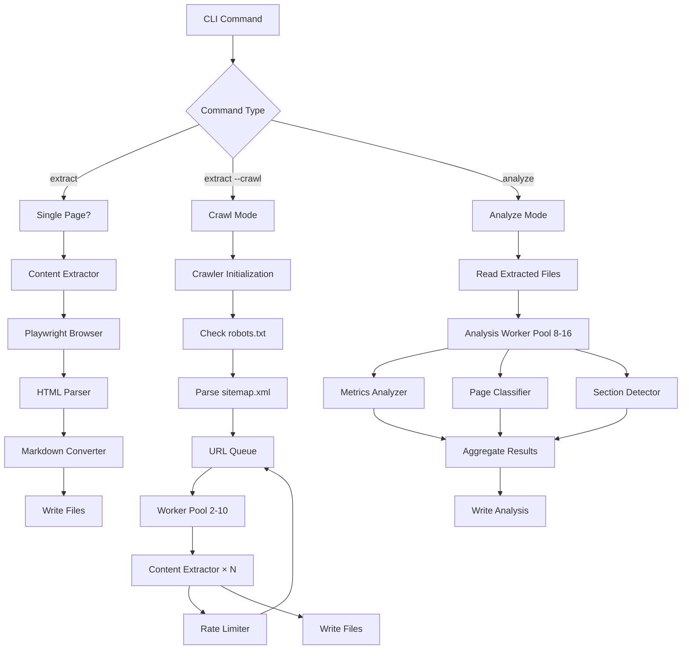
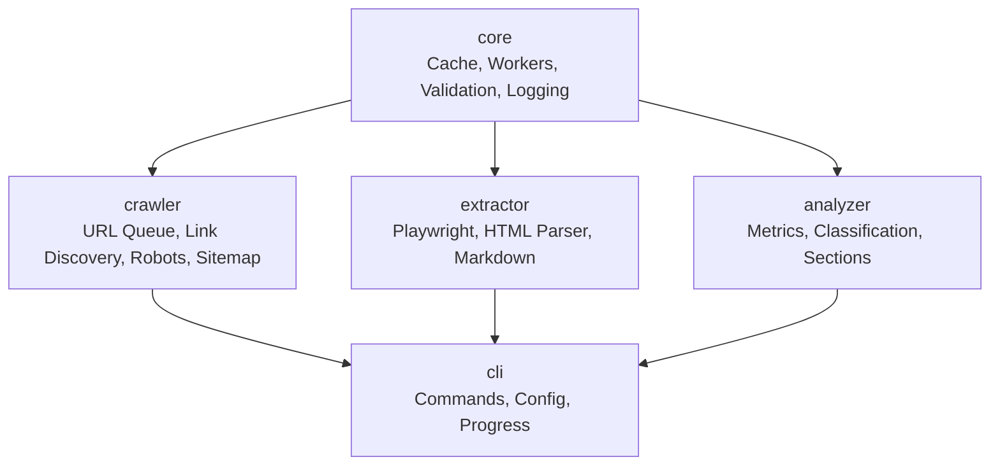

# site-generator

High-performance content extraction, crawling, and analysis pipeline for websites with parallel processing, full-site discovery, and content quality metrics.

[](https://opensource.org/licenses/MIT)


## Table of Contents

- [Features](#features)
- [Tech Stack](#tech-stack)
- [Quick Start](#quick-start)
- [Commands](#commands)
- [Configuration](#configuration)
- [Architecture](#architecture)
- [Project Structure](#project-structure)
- [Development](#development)
- [Troubleshooting](#troubleshooting)
- [Performance](#performance)
- [Contributing](#contributing)
- [License](#license)

## Features

**Content Extraction**

- Full JavaScript rendering with Playwright for SPAs and dynamic content
- Converts HTML to clean Markdown with Turndown
- Extracts metadata, images, links, tables, and code blocks
- Configurable retry logic with exponential backoff
- Robots.txt compliance checking
- Output formats: Markdown, JSON

**Website Crawling**

- Automatic link discovery and full-site crawling
- Concurrent extraction with 2-10 configurable workers
- Sitemap.xml parsing for efficient discovery
- Rate limiting with configurable delays
- State persistence for resumable crawls
- Live progress tracking with real-time statistics
- Graceful interrupt handling (Ctrl+C saves state)

**Content Analysis**

- Quality metrics scoring (0-100 scale)
- Readability analysis (Flesch reading ease)
- SEO analysis with actionable recommendations
- Page type classification (8 types: homepage, article, product, etc.)
- Section detection (header, nav, main, sidebar, footer)
- Parallel analysis with Piscina worker pools (8-16 threads)
- Cross-page analysis for site-wide insights

**Developer Experience**

- TypeScript with strict mode and full type safety
- ESM-first architecture
- Monorepo with pnpm workspaces and Turbo build orchestration
- Comprehensive error handling with detailed logging
- Performance monitoring and benchmarking tools
- User configuration system at `~/.site-generator/config.json`

## Tech Stack

**Runtime & Languages**

- Node.js >= 20.0.0 (ES2022)
- TypeScript 5.3+ (strict mode, ESNext modules)
- pnpm 8+ (workspace manager)

**Core Dependencies**

- **Playwright** 1.41+ - Browser automation for SPA rendering
- **Cheerio** 1.0+ - Fast HTML parsing
- **Turndown** 7.1+ - HTML to Markdown conversion
- **Piscina** 4.3+ - Worker thread pool management
- **Zod** 3.25+ - Schema validation

**Infrastructure**

- **Turbo** 1.12+ - Monorepo build orchestration
- **Vitest** 1.2+ - Unit and integration testing
- **lru-cache** 10.2+ - Multi-layer caching
- **p-limit** / **p-queue** - Concurrency control

**Analysis & NLP**

- **Natural** 6.12+ - NLP and text analysis
- **ml-kmeans** 6.0+ - Clustering algorithms
- **remark** / **unified** - Markdown AST processing

**Additional Tools**

- **Commander** 12.0+ - CLI framework
- **Chalk** / **Ora** - Terminal UI
- **cli-progress** - Progress bars
- **DOMPurify** / **jsdom** - HTML sanitization

## Quick Start

### Prerequisites

- Node.js >= 20.0.0
- pnpm >= 8.0.0
- Git >= 2.30.0

```bash
node --version    # Should be >= 20.0.0
pnpm --version    # Should be >= 8.0.0
```

### Installation

```bash
# Clone the repository
git clone https://github.com/your-org/site-generator.git
cd site-generator

# Install dependencies
pnpm install

# Install Playwright browsers (required for content extraction)
pnpm exec playwright install chromium

# Build all packages
pnpm build
```

### First Run

```bash
# Initialize configuration file
node packages/cli/dist/index.js init

# Extract a single page
node packages/cli/dist/index.js extract --url https://example.com --output ./extracted

# Crawl an entire website (with 5 concurrent workers)
node packages/cli/dist/index.js extract --url https://example.com --output ./crawled --crawl

# Analyze extracted content
node packages/cli/dist/index.js analyze --input ./crawled --output ./analysis --all

# View results
cat analysis/summary.json
```

## Commands

### `init` - Initialize Configuration

Creates a configuration file at `~/.site-generator/config.json` with default settings.

```bash
node packages/cli/dist/index.js init
```

**Generated config:**

```json
{
  "crawler": {
    "concurrency": 5,
    "maxConcurrency": 10,
    "delayMs": 1000,
    "maxPages": 1000,
    "respectRobotsTxt": true,
    "userAgent": "site-generator-bot/1.0"
  },
  "extractor": {
    "timeout": 30000,
    "retryAttempts": 3,
    "format": "markdown"
  }
}
```

See: `packages/cli/src/config/ConfigManager.ts`

### `extract` - Extract Content

Extract content from a URL or crawl an entire website with link discovery.

**Single Page Extraction:**

```bash
node packages/cli/dist/index.js extract \
  --url https://example.com \
  --output ./extracted \
  --format markdown \
  --retry 3 \
  --verbose
```

**Full Site Crawling:**

```bash
node packages/cli/dist/index.js extract \
  --url https://example.com \
  --output ./crawled \
  --crawl \
  --concurrency 8 \
  --resume
```

**Options:**
| Option | Type | Default | Description |
|--------|------|---------|-------------|
| `--url <url>` | string | Required | URL to extract content from |
| `--output <dir>` | string | `./extracted` | Output directory for extracted files |
| `--format <format>` | string | `markdown` | Output format: `markdown` or `json` |
| `--no-robots` | boolean | `false` | Skip robots.txt check (use responsibly) |
| `--retry <n>` | number | `3` | Number of retry attempts on failure |
| `--verbose` | boolean | `false` | Show detailed logs |
| `--crawl` | boolean | `false` | Crawl entire site with link discovery |
| `--concurrency <n>` | number | `5` | Concurrent workers (2-10) for crawling |
| `--resume` | boolean | `false` | Resume interrupted crawl from saved state |

**Output files:**

- `{domain}_{timestamp}.md` - Main content in Markdown
- `{domain}_{timestamp}_metadata.json` - Extraction metadata
- `.crawl-state.json` - Crawl state (for resume, auto-deleted on completion)

See: `packages/cli/src/commands/extract.ts`, `packages/extractor/src/extractor.ts`

### `analyze` - Analyze Content

Analyze extracted content for quality, readability, SEO, page classification, and structure.

```bash
node packages/cli/dist/index.js analyze \
  --input ./crawled \
  --output ./analysis \
  --all \
  --verbose
```

**Options:**
| Option | Type | Default | Description |
|--------|------|---------|-------------|
| `--input <dir>` | string | Required | Directory containing extracted content |
| `--output <dir>` | string | `./analysis` | Output directory for analysis results |
| `--metrics` | boolean | `false` | Run quality, readability, SEO analysis |
| `--classification` | boolean | `false` | Run page type classification |
| `--sections` | boolean | `false` | Run section detection analysis |
| `--all` | boolean | `false` | Run all analysis types (default if none specified) |
| `--verbose` | boolean | `false` | Show detailed logs |

**Output files (per page):**

- `{domain}_{timestamp}_analysis.json` - Full analysis results
- `{domain}_{timestamp}_metrics.json` - Quality metrics
- `{domain}_{timestamp}_classification.json` - Page type classification
- `{domain}_{timestamp}_sections.json` - Detected sections
- `summary.json` - Aggregated summary across all pages

**Analysis Types:**

- **Metrics**: Quality score (0-100), readability (Flesch), SEO score with recommendations
- **Classification**: Page type (homepage, article, product, landing, documentation, blog, category, contact)
- **Sections**: Structural analysis (header, navigation, main content, sidebar, footer)

See: `packages/cli/src/commands/analyze.ts`, `packages/analyzer/src/analysis/AnalysisOrchestrator.ts`

## Configuration

### User Configuration File

Location: `~/.site-generator/config.json`

**Full schema:**

```json
{
  "crawler": {
    "concurrency": 5, // Number of concurrent workers (2-maxConcurrency)
    "maxConcurrency": 10, // Maximum allowed concurrency
    "delayMs": 1000, // Delay between requests (ms)
    "maxPages": 1000, // Maximum pages to crawl per site
    "respectRobotsTxt": true, // Check robots.txt before crawling
    "userAgent": "site-generator-bot/1.0"
  },
  "extractor": {
    "timeout": 30000, // Page load timeout (ms)
    "retryAttempts": 3, // Retry attempts on failure
    "format": "markdown" // Default output format: "markdown" | "json"
  }
}
```

See: `packages/cli/src/config/ConfigManager.ts`

### Environment Variables

**None required.** Configuration is file-based. However, these standard Node.js variables are respected:

| Variable       | Usage                                      | Default                |
| -------------- | ------------------------------------------ | ---------------------- |
| `NODE_ENV`     | Build mode (`production` or `development`) | `development`          |
| `NODE_OPTIONS` | Node.js runtime options                    | See `scripts/build.js` |
| `CI`           | CI/CD mode (affects test reporters)        | Not set                |

## Architecture

### High-Level Data Flow



### Package Architecture



**Package Responsibilities:**

- **`@site-generator/core`** - Shared infrastructure: worker pools (Piscina), LRU caching, validation (Zod), metrics collection, error handling, logging, rate limiting
- **`@site-generator/crawler`** - URL management: queue, normalizer, link discovery (Cheerio), sitemap parser, robots.txt checker, state persistence
- **`@site-generator/extractor`** - Content extraction: Playwright browser manager, HTML parsing (Cheerio), Markdown conversion (Turndown), media extraction, content filtering, sanitization (DOMPurify)
- **`@site-generator/analyzer`** - Content analysis: metrics calculation, page classification (ML-based), section detection, readability scoring (Flesch), SEO analysis, worker-based parallel processing
- **`@site-generator/cli`** - User interface: Commander-based CLI, configuration management, progress tracking (Ora, cli-progress), crawl orchestration
- **`@site-generator/testing`** - Test utilities: Vitest helpers, mocks, fixtures

See: `packages/*/src/index.ts` for exports

## Project Structure

```
site-generator/
├── packages/                   # Monorepo packages (pnpm workspace)
│   ├── core/                   # @site-generator/core
│   │   ├── src/
│   │   │   ├── cache/          # LRU cache implementation
│   │   │   ├── worker/         # Piscina worker pool
│   │   │   ├── validation/     # Zod validators
│   │   │   ├── metrics/        # Metrics collection
│   │   │   ├── logger/         # Structured logging
│   │   │   ├── health/         # Health checks
│   │   │   └── rate-limiting/  # Rate limiters
│   │   └── package.json
│   ├── crawler/                # @site-generator/crawler
│   │   ├── src/
│   │   │   ├── crawler/        # Main crawler class
│   │   │   ├── queue/          # URL queue management
│   │   │   ├── discovery/      # Link discovery
│   │   │   ├── sitemap/        # Sitemap parser
│   │   │   ├── robots/         # Robots.txt checker
│   │   │   └── state/          # Crawl state persistence
│   │   └── package.json
│   ├── extractor/              # @site-generator/extractor
│   │   ├── src/
│   │   │   ├── browser/        # Playwright browser manager
│   │   │   ├── renderers/      # Page renderers
│   │   │   ├── extractor.ts    # Main extractor
│   │   │   ├── html-parser.ts  # Cheerio-based parser
│   │   │   └── markdown-converter.ts
│   │   └── package.json
│   ├── analyzer/               # @site-generator/analyzer
│   │   ├── src/
│   │   │   ├── analysis/
│   │   │   │   ├── AnalysisOrchestrator.ts
│   │   │   │   ├── ContentMetricsAnalyzer.ts
│   │   │   │   ├── PageTypeClassifier.ts
│   │   │   │   └── SectionDetector.ts
│   │   │   └── workers/        # Analysis worker threads
│   │   └── package.json
│   ├── cli/                    # @site-generator/cli
│   │   ├── src/
│   │   │   ├── commands/       # init, extract, analyze
│   │   │   ├── config/         # ConfigManager
│   │   │   ├── crawl/          # CrawlOrchestrator
│   │   │   └── utils/          # Progress display, file writers
│   │   └── package.json
│   └── testing/                # @site-generator/testing
│       └── src/
├── scripts/                    # Build and utility scripts
│   ├── build.js                # Turbo build orchestration
│   ├── monitor.js              # Performance monitoring
│   ├── benchmark.js            # Performance benchmarks
│   └── test-integration.js     # Integration test runner
├── config/                     # Tool configurations
│   ├── clinic.config.json      # Clinic.js profiling
│   ├── memory.config.ts        # Memory optimization
│   └── *.config.js             # esbuild, webpack, swc, etc.
├── docs/                       # Documentation
│   ├── architecture/           # System design docs
│   ├── api/                    # API documentation
│   └── guides/                 # User guides
├── test/                       # Integration tests
│   ├── integration/            # Integration test suites
│   └── setup.ts                # Test setup
├── package.json                # Root package manifest
├── pnpm-workspace.yaml         # pnpm workspace config
├── turbo.json                  # Turbo build config
├── tsconfig.json               # Root TypeScript config
├── vitest.config.ts            # Vitest test config
└── CONTRIBUTING.md             # Contribution guidelines
```

## Development

### Scripts

| Script             | Command                 | Description                                      |
| ------------------ | ----------------------- | ------------------------------------------------ |
| `dev`              | `pnpm dev`              | Build all packages in watch mode with monitoring |
| `build`            | `pnpm build`            | Build all packages with Turbo (incremental)      |
| `build:prod`       | `pnpm build:prod`       | Production build with optimizations              |
| `build:watch`      | `pnpm build:watch`      | Watch mode with live monitoring                  |
| `test`             | `pnpm test`             | Run all unit tests with Vitest                   |
| `test:watch`       | `pnpm test:watch`       | Run tests in watch mode with UI                  |
| `test:coverage`    | `pnpm test:coverage`    | Generate coverage report (70%+ threshold)        |
| `test:integration` | `pnpm test:integration` | Run integration tests                            |
| `lint`             | `pnpm lint`             | Run ESLint on all packages                       |
| `type-check`       | `pnpm type-check`       | TypeScript type checking                         |
| `format`           | `pnpm format`           | Format code with Prettier                        |
| `clean`            | `pnpm clean`            | Remove build artifacts and caches                |
| `benchmark`        | `pnpm benchmark`        | Run performance benchmarks                       |
| `monitor`          | `pnpm monitor`          | Monitor real-time performance metrics            |
| `perf`             | `pnpm perf`             | Run performance analysis                         |
| `perf:clinic`      | `pnpm perf:clinic`      | Profile with Clinic.js heap profiler             |
| `perf:doctor`      | `pnpm perf:doctor`      | Diagnose performance with Clinic.js              |

See: `package.json` scripts section

### Build System

**Turbo Configuration** (`turbo.json`):

- **Incremental builds**: Only rebuild changed packages
- **Parallel execution**: Utilizes all CPU cores
- **Build caching**: Local and remote cache support
- **Dependency graph**: Respects package dependencies

**Build pipeline:**

```bash
# Build all packages (respects dependency order)
pnpm build

# Build specific package
pnpm --filter @site-generator/cli build

# Watch mode for development
pnpm dev
```

### Testing

**Framework**: Vitest with 16-thread parallel execution

**Run tests:**

```bash
# All tests
pnpm test

# Watch mode with UI
pnpm test:watch

# Coverage (70%+ threshold)
pnpm test:coverage

# Integration tests only
pnpm test:integration
```

**Test structure:**

- Unit tests: `*.test.ts` alongside source files
- Integration tests: `test/integration/`
- Setup: `test/setup.ts`

**Coverage thresholds** (see `vitest.config.ts`):

- Branches: 70%
- Functions: 70%
- Lines: 70%
- Statements: 70%

### Git Hooks

**Pre-commit** (via `simple-git-hooks` + `lint-staged`):

- ESLint auto-fix on `.ts`, `.tsx`, `.js`, `.jsx`
- Prettier format on all supported files
- Vitest runs related tests for TypeScript changes

**Pre-push**:

- Full test suite (`pnpm test`)

## Troubleshooting

### Browser Not Found

**Error:** `browserType.launch: Executable doesn't exist`

**Solution:**

```bash
pnpm exec playwright install chromium
```

### Crawl Interrupted

If a crawl is interrupted (Ctrl+C), state is saved automatically.

**Resume:**

```bash
node packages/cli/dist/index.js extract \
  --url https://example.com \
  --output ./data \
  --crawl \
  --resume
```

**State file location:** `{outputDir}/.crawl-state.json`

See: `packages/crawler/src/state/CrawlState.ts`

### High Memory Usage

If experiencing high memory usage during crawling:

```bash
# Reduce concurrency
node packages/cli/dist/index.js extract \
  --url https://example.com \
  --output ./data \
  --crawl \
  --concurrency 2
```

Edit config to reduce batch sizes:

```json
{
  "crawler": {
    "concurrency": 2,
    "delayMs": 2000
  }
}
```

**Memory limits** (see `scripts/build.js`):

- Max old space: 14GB (14336MB)
- Configurable via `NODE_OPTIONS`

### ESM Import Errors

**Error:** `Cannot find module` or `ERR_MODULE_NOT_FOUND`

**Causes:**

- Missing `.js` extensions in imports
- Incorrect `package.json` `type: "module"`
- Missing build step

**Solutions:**

```bash
# Rebuild all packages
pnpm clean && pnpm build

# Check package.json has "type": "module"
# Check imports use .js extensions (even for .ts files)
```

See: Root `tsconfig.json` (module: "ESNext", moduleResolution: "bundler")

### Rate Limiting by Target Site

If receiving 429 errors or being blocked:

**Edit config:**

```json
{
  "crawler": {
    "delayMs": 2000,
    "concurrency": 2
  }
}
```

**Use `--no-robots` responsibly:**

```bash
node packages/cli/dist/index.js extract \
  --url https://example.com \
  --output ./data \
  --crawl \
  --no-robots \
  --concurrency 2
```

See: `packages/core/src/rate-limiting/index.ts`

### TypeScript Errors After Upgrade

```bash
# Clean build artifacts
pnpm clean

# Reinstall dependencies
rm -rf node_modules pnpm-lock.yaml
pnpm install

# Rebuild
pnpm build
```

## Performance

### Benchmarks

**Single page extraction:**

- Cold start: 3-5 seconds
- Warm cache: 1-2 seconds

**Full site crawling:**

- 5 workers: ~1 page/second (with 1s delay)
- 10 workers: ~2 pages/second (with 1s delay)
- Memory: < 1GB for 5 concurrent workers

**Content analysis:**

- Single page: 200-500ms
- 100 pages: 10-20s (with 16-thread pool)

**Run benchmarks:**

```bash
pnpm benchmark
```

See: `scripts/benchmark.js`

### Optimization Tips

**Faster crawling:**

```bash
# Increase concurrency (up to 10)
--concurrency 10

# Reduce delay (if site allows)
# Edit ~/.site-generator/config.json:
{ "crawler": { "delayMs": 500 } }
```

**Reduce memory usage:**

```bash
# Lower concurrency
--concurrency 2

# Limit pages
# Edit config: { "crawler": { "maxPages": 100 } }
```

**Faster analysis:**

- Analysis uses Piscina worker pools (8-16 threads automatically)
- Adjust in `packages/analyzer/src/analysis/AnalysisOrchestrator.ts`

### Monitoring

**Real-time monitoring:**

```bash
pnpm monitor
```

**Profiling:**

```bash
# Heap profiler
pnpm perf:clinic

# Performance doctor
pnpm perf:doctor
```

See: `scripts/monitor.js`, `config/clinic.config.json`

## Contributing

Contributions are welcome! Please read [CONTRIBUTING.md](./CONTRIBUTING.md) for:

- Development workflow
- Code style guidelines
- Testing requirements
- PR submission process
- Git hooks and linting

**Key guidelines:**

- Node.js >= 20.0.0, pnpm >= 8.0.0
- TypeScript strict mode
- ESM modules with `.js` extensions in imports
- Tests required for new features
- ESLint + Prettier enforced via pre-commit hooks

## License

MIT

See: `package.json` (license field)

---

**Documentation:**

- [Architecture Overview](./docs/architecture/overview.md)
- [API Documentation](./docs/api/core.md)
- [Phase Completion Reports](./docs/)
- [Examples](./docs/EXAMPLES.md)

**Built with:**

- [Playwright](https://playwright.dev/) - Browser automation
- [Piscina](https://github.com/piscinajs/piscina) - Worker threads
- [Turbo](https://turbo.build/) - Monorepo build system
- [Vitest](https://vitest.dev/) - Testing framework
