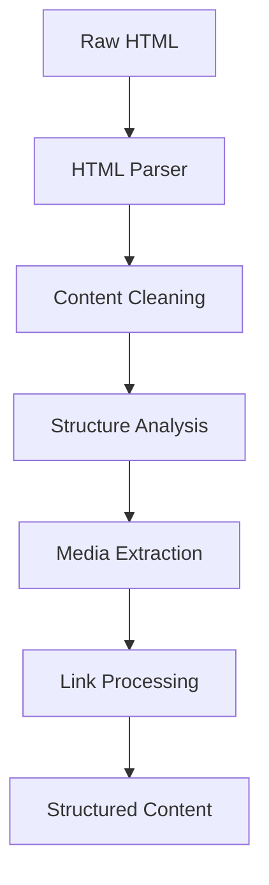
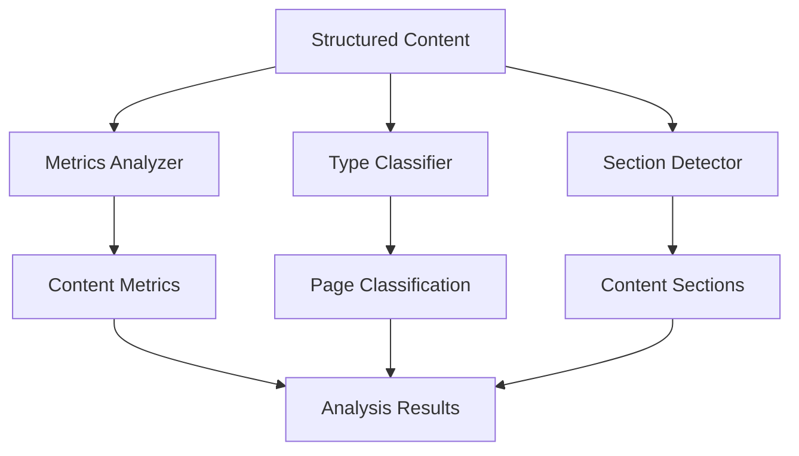
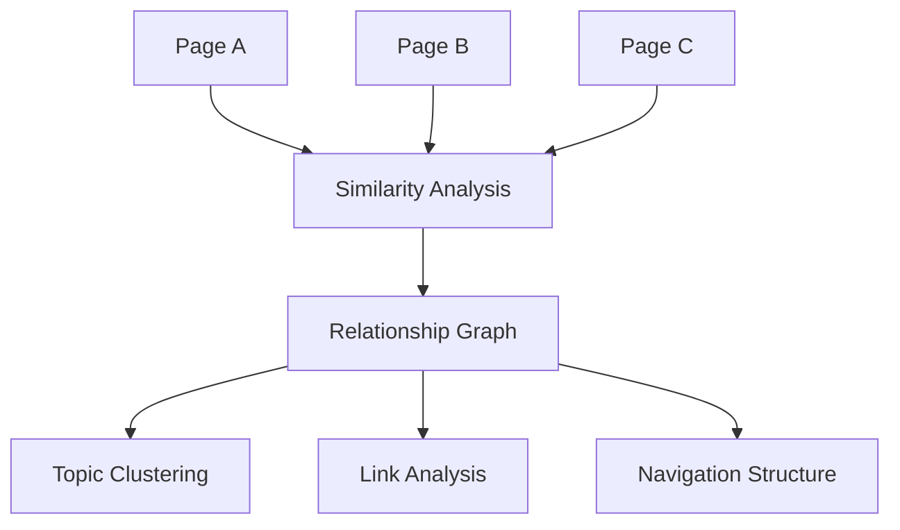
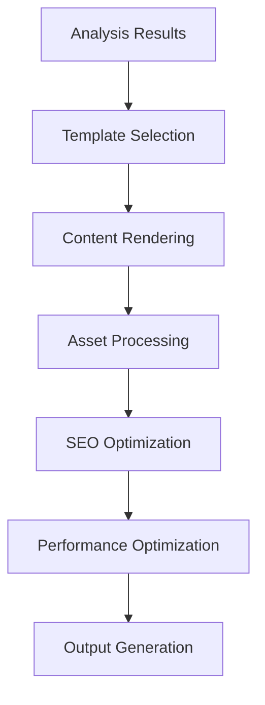

# Data Flow Architecture

## Overview

The Site Generator processes content through a sophisticated pipeline that transforms raw input into optimized static sites. This document details the data flow and transformations at each stage.

## Input Sources

### Supported Input Types

- **URLs**: Web pages and websites
- **HTML Files**: Local HTML files
- **Markdown Files**: Markdown documents
- **API Endpoints**: REST and GraphQL APIs
- **Databases**: Content from various databases
- **File Systems**: Directory structures and file collections

### Input Validation

```typescript
interface InputValidation {
  url?: string; // Valid URL format
  file?: string; // Existing file path
  content?: string; // Raw content string
  metadata?: object; // Additional metadata
}
```

## Stage 1: Content Extraction

### HTML Parsing Pipeline



### Data Transformations

#### Input: Raw HTML

```html
<!DOCTYPE html>
<html>
  <head>
    <title>Example Page</title>
    <meta name="description" content="Example description" />
  </head>
  <body>
    <h1>Main Title</h1>
    <p>Content paragraph with <a href="/link">link</a>.</p>
    
  </body>
</html>
```

#### Output: Structured Content

```typescript
interface ExtractedContent {
  url: string;
  title: string;
  content: string; // Cleaned HTML
  markdown: string; // Converted markdown
  metadata: {
    description: string;
    author?: string;
    published?: string;
    tags?: string[];
  };
  media: MediaFile[];
  links: LinkInfo[];
  structure: ContentStructure;
}
```

### Content Cleaning Process

1. **Script Removal**: Strip JavaScript and tracking scripts
2. **Style Normalization**: Normalize CSS styles
3. **Whitespace Cleaning**: Remove excessive whitespace
4. **Attribute Filtering**: Remove unnecessary HTML attributes
5. **Content Validation**: Validate content integrity

### Media Extraction

```typescript
interface MediaExtraction {
  images: ImageFile[];
  videos: VideoFile[];
  documents: DocumentFile[];
  assets: AssetFile[];
}

interface ImageFile {
  url: string;
  localPath: string;
  optimized: boolean;
  formats: string[]; // ['webp', 'jpg', 'png']
  sizes: ImageSize[]; // Responsive sizes
  metadata: ImageMetadata;
}
```

## Stage 2: Content Analysis

### Analysis Pipeline



### Metrics Analysis

```typescript
interface ContentMetrics {
  wordCount: number;
  readingTime: number; // Estimated minutes
  complexity: number; // 0-1 scale
  readability: number; // Flesch-Kincaid score
  language: string; // Detected language
  sentiment: number; // -1 to 1 scale
  topics: string[]; // Detected topics
  keywords: KeywordInfo[]; // Keyword analysis
}
```

### Page Classification

```typescript
interface PageClassification {
  type: PageType;
  confidence: number; // 0-1 confidence score
  features: ClassificationFeature[];
  rules: ClassificationRule[];
}

type PageType =
  | "article"
  | "documentation"
  | "landing"
  | "product"
  | "about"
  | "contact"
  | "gallery"
  | "form";
```

### Section Detection

```typescript
interface ContentSection {
  type: SectionType;
  level?: number; // For headings
  content: string;
  metadata: SectionMetadata;
  position: number; // Order in document
}

type SectionType =
  | "heading"
  | "paragraph"
  | "list"
  | "code"
  | "quote"
  | "image"
  | "table";
```

## Stage 3: Cross-Page Analysis

### Relationship Detection



### Similarity Analysis

```typescript
interface SimilarityAnalysis {
  embeddings: number[]; // Vector embeddings
  similarities: SimilarityPair[];
  clusters: TopicCluster[];
  recommendations: PageRecommendation[];
}

interface SimilarityPair {
  pageA: string;
  pageB: string;
  similarity: number; // 0-1 similarity score
  factors: SimilarityFactor[];
}
```

### Navigation Generation

```typescript
interface NavigationStructure {
  hierarchy: NavigationNode[];
  breadcrumbs: BreadcrumbInfo[];
  related: RelatedPageInfo[];
  sitemap: SitemapStructure;
}

interface NavigationNode {
  title: string;
  url: string;
  children: NavigationNode[];
  metadata: NavigationMetadata;
}
```

## Stage 4: Site Generation

### Generation Pipeline



### Template Processing

```typescript
interface TemplateData {
  page: PageData;
  site: SiteData;
  theme: ThemeData;
  navigation: NavigationStructure;
  metadata: SiteMetadata;
}

interface PageData {
  title: string;
  content: string;
  metadata: PageMetadata;
  sections: ContentSection[];
  metrics: ContentMetrics;
  type: PageType;
}
```

### Asset Processing

```typescript
interface AssetProcessing {
  images: ImageOptimization[];
  styles: StyleProcessing[];
  scripts: ScriptProcessing[];
  fonts: FontOptimization[];
}

interface ImageOptimization {
  original: ImageFile;
  optimized: ImageFile[];
  responsive: ResponsiveImage[];
  formats: FormatConversion[];
}
```

### SEO Enhancement

```typescript
interface SEOEnhancement {
  meta: MetaTags;
  structured: StructuredData;
  sitemap: SitemapData;
  robots: RobotsData;
  canonical: CanonicalUrls;
}

interface MetaTags {
  title: string;
  description: string;
  keywords: string[];
  og: OpenGraphData;
  twitter: TwitterCardData;
}
```

## Stage 5: Output Generation

### File Structure

```
dist/
├── index.html
├── pages/
│   ├── about.html
│   ├── contact.html
│   └── blog/
│       ├── post-1.html
│       └── post-2.html
├── assets/
│   ├── images/
│   │   ├── optimized/
│   │   └── responsive/
│   ├── styles/
│   │   └── main.css
│   └── scripts/
│       └── main.js
├── sitemap.xml
├── robots.txt
└── site-metadata.json
```

### Performance Optimization

```typescript
interface PerformanceOptimization {
  compression: CompressionSettings;
  caching: CacheHeaders;
  minification: MinificationSettings;
  bundling: BundleOptimization;
  lazyLoading: LazyLoadingSettings;
}

interface CompressionSettings {
  gzip: boolean;
  brotli: boolean;
  level: number; // Compression level
  threshold: number; // Minimum file size
}
```

## Data Flow Monitoring

### Metrics Collection

```typescript
interface FlowMetrics {
  stage: ProcessingStage;
  duration: number; // Processing time
  memory: MemoryUsage; // Memory consumption
  throughput: number; // Items per second
  errors: ErrorInfo[]; // Processing errors
  quality: QualityMetrics; // Output quality
}

type ProcessingStage =
  | "extraction"
  | "analysis"
  | "generation"
  | "optimization"
  | "output";
```

### Quality Assurance

```typescript
interface QualityMetrics {
  completeness: number; // 0-1 completeness score
  accuracy: number; // 0-1 accuracy score
  performance: number; // 0-1 performance score
  seo: number; // 0-1 SEO score
  accessibility: number; // 0-1 accessibility score
}
```

## Error Handling & Recovery

### Error Categories

- **Input Errors**: Invalid input data or format
- **Processing Errors**: Errors during content processing
- **Resource Errors**: Memory, CPU, or I/O issues
- **Output Errors**: File generation or writing errors

### Recovery Strategies

```typescript
interface RecoveryStrategy {
  retry: RetryConfig;
  fallback: FallbackConfig;
  degradation: DegradationConfig;
  notification: NotificationConfig;
}

interface RetryConfig {
  maxAttempts: number;
  backoff: BackoffStrategy;
  conditions: RetryCondition[];
}
```

## Performance Considerations

### Bottleneck Identification

- **I/O Bound**: File reading/writing operations
- **CPU Bound**: Content processing and analysis
- **Memory Bound**: Large dataset processing
- **Network Bound**: External API calls and downloads

### Optimization Strategies

- **Parallel Processing**: Multi-threaded execution
- **Caching**: Aggressive result caching
- **Streaming**: Stream-based processing
- **Batching**: Batch processing for efficiency
