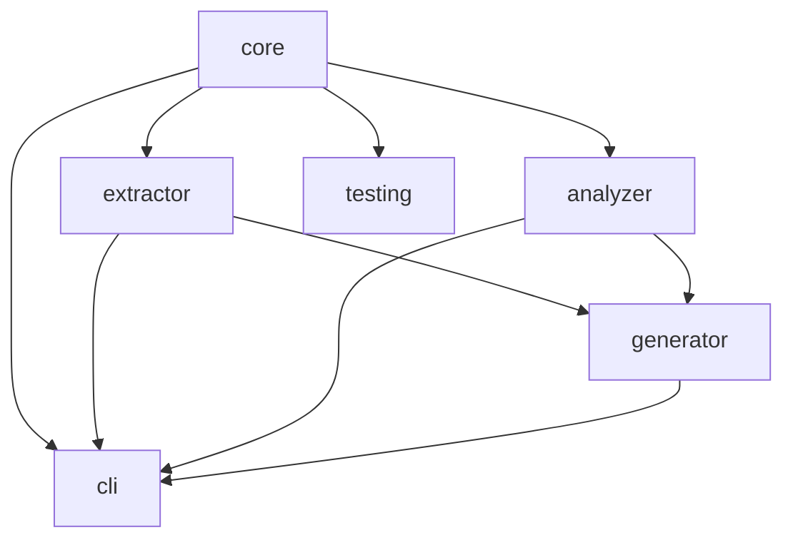
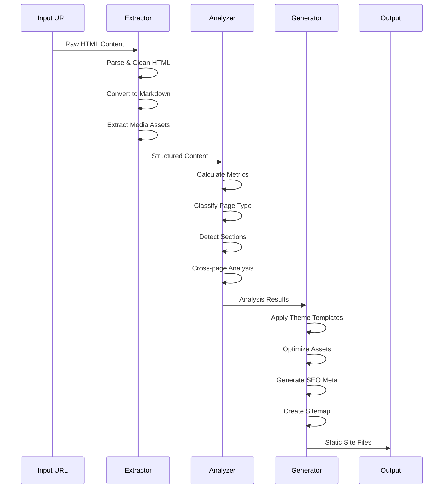

# Architecture Overview

## System Architecture

The Site Generator is built as a high-performance, enterprise-grade static site generator with a focus on scalability, performance, and maintainability.

## Core Principles

### 1. Performance-First Design

- **Parallel Processing**: 16-thread worker pool with Piscina
- **Memory Optimization**: 14GB heap allocation for large datasets
- **LRU Caching**: Multi-layer caching with TTL support
- **Incremental Builds**: TypeScript composite projects with build caching

### 2. Modular Architecture

- **Monorepo Structure**: Clean package separation with clear responsibilities
- **Dependency Graph**: core → extractor → analyzer → generator → cli
- **Workspace Management**: pnpm workspaces with Turbo for build orchestration

### 3. Resilience & Reliability

- **Circuit Breaker Patterns**: Automatic failure detection and recovery
- **Retry Logic**: Exponential backoff with jitter
- **Health Monitoring**: Real-time worker pool and system health checks
- **Error Boundaries**: Comprehensive error handling and reporting

## Package Architecture

```
packages/
├── core/           # Shared utilities, types, and infrastructure
├── extractor/      # Content extraction from various sources
├── analyzer/       # Content analysis and classification
├── generator/      # Static site generation and optimization
├── cli/           # Command-line interface
└── testing/       # Testing utilities and helpers
```

### Package Dependencies



## Data Flow

### Content Processing Pipeline



## Performance Characteristics

### Memory Management

- **Heap Size**: 14GB maximum allocation
- **Cache Layers**: Multiple LRU caches with different TTLs
- **Memory Pooling**: Reusable object pools for frequent allocations
- **Garbage Collection**: Optimized GC settings for Node.js

### CPU Utilization

- **Worker Threads**: 16-thread parallel processing
- **Batch Processing**: 50-item batches for optimal throughput
- **Load Balancing**: Intelligent work distribution across threads
- **Resource Monitoring**: Real-time CPU and memory tracking

### I/O Optimization

- **Streaming**: Stream-based processing for large files
- **Concurrent Operations**: Parallel file I/O operations
- **Caching**: Aggressive caching of processed content
- **Compression**: Gzip/Brotli compression for output files

## Scalability Features

### Horizontal Scaling

- **Worker Pool**: Configurable thread pool size
- **Batch Processing**: Adjustable batch sizes
- **Memory Limits**: Configurable memory thresholds
- **Queue Management**: Priority-based task queuing

### Vertical Scaling

- **Resource Monitoring**: Automatic resource usage tracking
- **Adaptive Processing**: Dynamic adjustment based on available resources
- **Memory Management**: Intelligent memory allocation and cleanup
- **Performance Metrics**: Real-time performance monitoring

## Security Considerations

### Input Validation

- **Schema Validation**: Zod-based input validation
- **Sanitization**: HTML content sanitization
- **URL Validation**: Strict URL format validation
- **File Type Checking**: MIME type validation for uploads

### Output Security

- **XSS Prevention**: Content sanitization in templates
- **CSRF Protection**: Token-based request validation
- **Content Security Policy**: CSP headers in generated sites
- **HTTPS Enforcement**: Secure connection requirements

## Monitoring & Observability

### Metrics Collection

- **Performance Metrics**: Execution time, memory usage, CPU utilization
- **Business Metrics**: Pages processed, cache hit rates, error rates
- **Custom Metrics**: Application-specific performance indicators
- **Real-time Dashboards**: Live monitoring of system health

### Logging

- **Structured Logging**: JSON-formatted logs with context
- **Log Levels**: Debug, info, warn, error with appropriate filtering
- **Correlation IDs**: Request tracing across components
- **Performance Logging**: Detailed timing information

### Health Checks

- **Worker Health**: Individual worker thread status
- **Cache Health**: Cache performance and availability
- **Resource Health**: Memory, CPU, and disk usage
- **External Dependencies**: Third-party service availability

## Deployment Architecture

### Build Process

- **Incremental Builds**: Only rebuild changed components
- **Parallel Compilation**: Multi-threaded TypeScript compilation
- **Asset Optimization**: Image, CSS, and JavaScript optimization
- **Bundle Analysis**: Size and dependency analysis

### Distribution

- **Static Output**: Pure static file generation
- **CDN Ready**: Optimized for content delivery networks
- **SEO Optimized**: Comprehensive SEO enhancements
- **Performance Optimized**: Fast loading and rendering

## Future Considerations

### Planned Enhancements

- **Plugin System**: Extensible plugin architecture
- **Multi-language Support**: Internationalization features
- **Advanced Analytics**: Built-in analytics and reporting
- **Cloud Integration**: Native cloud platform support

### Scalability Roadmap

- **Microservices**: Potential microservices decomposition
- **Container Support**: Docker and Kubernetes deployment
- **Edge Computing**: Edge-based content generation
- **Real-time Updates**: Live content synchronization
